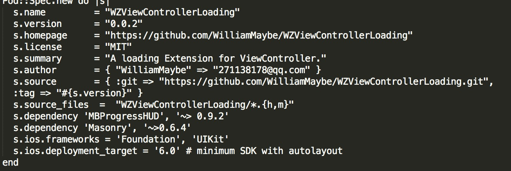
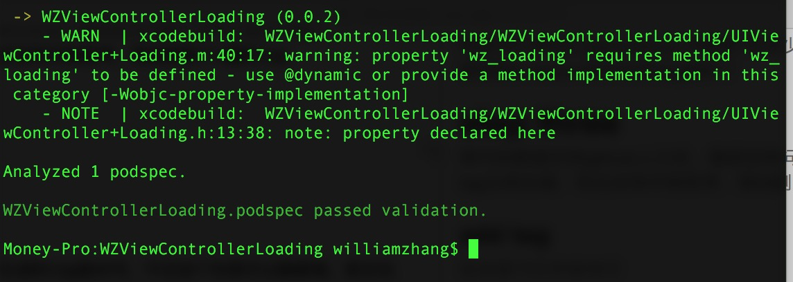

# WZViewControllerLoading
ViewController loading状态

### 小结
第一次上传到pod上，碰到许多坑，一开始试的时候什么文件都没有，就直接上手了，导致各种报错，所以提醒各位，最先要弄先把所有的代码写好。

## step one
命令行使用	 
`
pod spec create [NAME]		
// 本文中使用
pod spec create WZViewControllerLoading
`

完成之后生成WZViewControllerLoading.podspec文件

## step two
将podspec中相应信息填写完整	

需要自行添加s.dependency 依赖库 有多少写多少
之后要提交版本只需要更新s.version到对应的tag就好了

## step three
将代码都提交到github上之后，确保没有问题，可以开始打tag了
使用tag比较生疏，而且没有仔细思考，添加删除了n遍的tag

### add tag
在目录下打开命令行

```
// 本地创建 tag		
git tag 0.0.1		

// 0.0.1即为自己要生成的tag版本号，不过这个东西可以随便填，英文也没事，只要能分清，但是讲道理还是弄的规范化好

// 将tag提交到github
git push origin --tags
// 通过
```

由于碰到很多坑，决定把删除tag的方法也写出来吧

```
// 删除本地tag
git tag -d 0.0.1
// 删除git远程tag
git push origin :refs/tags/0.0.1
```
### step four
必不可少的一步 ***--allow-warnings***忽略警告

```
pod spec lint WZViewControllerLoading.podspec --allow-warnings
```

出现xxx.podspec passed validation即为成功

接下来准备正式发布到cocoapods上了。

```
// 先要注册个cocoapods trunk帐号
pod trunk register xxxx@xxxx.com 'william' --description='macbook pro'
```
信息填写正确就好了，会收到一封邮件

```
// 验证是否生效
pod trunk me

//成功后就可以上传自己的库了，实际上传的只是podspec而已，它会帮你定位到相应的版本代码
pod trunk push WZViewControllerLoading.podspec --allow-warnings
```
不加**--allow-warnings**若代码有warning则无法通过。

#### Success
等待成功之后就可以		
pod search WZViewContrllerLoading 拉


# 本库使用
说了这么久的pod上传，可以说说本库的使用方法了，很简单的一个ViewController自带简易loading

有后续的话会修改import部分

```
#import <WZViewControllerLoading/UIViewController+Loading.h>

// 直接在ViewController中调用
[self wz_postLoading];
[self wz_postError:@"error_message"];
[self wz_hideLoading];
```
简单的loading，详情看代码哦。
